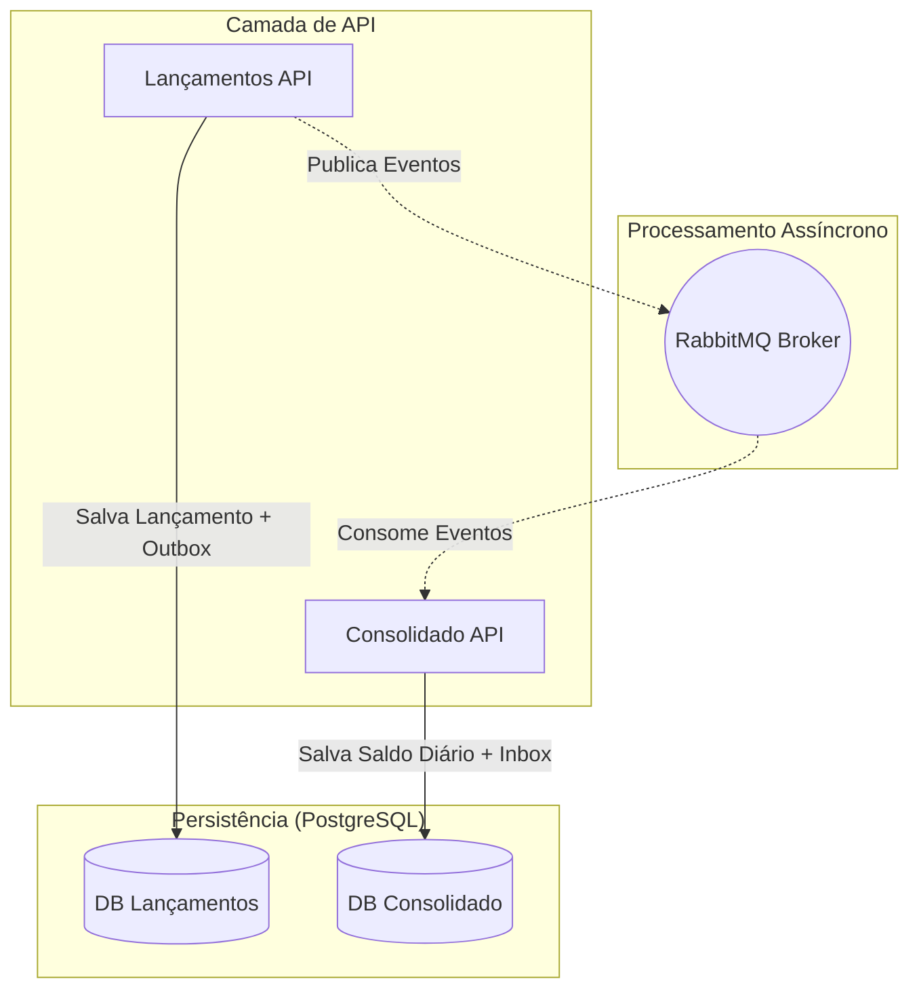
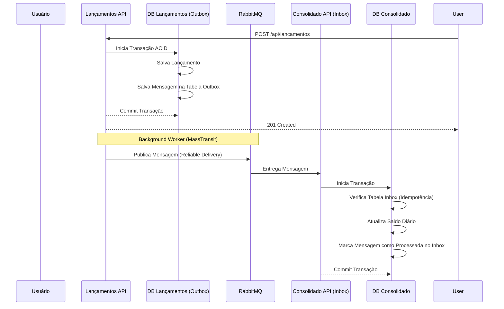

# CashFlow Solution - Arquiteto de Software Sênior

Este projeto é uma solução completa para o desafio de controle de fluxo de caixa, desenvolvida com foco em **escalabilidade**, **resiliência** e **observabilidade**. A arquitetura foi desenhada para suportar alta carga (50 req/s) mantendo a integridade dos dados através de padrões de mensageria e consistência eventual.

## Arquitetura do Sistema

A solução utiliza uma arquitetura de **microsserviços** baseada em **Domain-Driven Design (DDD)** e **CQRS (Command Query Responsibility Segregation)** básico via MediatR.

### Diagrama de Contexto (C4 Model - Level 2)



### Fluxo de Dados (Outbox & Inbox Pattern)

Este fluxo garante que **nenhuma mensagem seja perdida** e que o processamento seja **idempotente**.



## Padrões e Práticas Aplicadas

- **Outbox Pattern**: Garante a consistência atômica entre a persistência do banco de dados e a publicação de mensagens no RabbitMQ.
- **Inbox Pattern (Idempotência)**: O serviço consolidado utiliza o Inbox do MassTransit para garantir que cada lançamento seja processado exatamente uma vez, mesmo em caso de reenvio de mensagens.
- **Resiliência (Polly)**: Configurações de **Retry** e **Circuit Breaker** no pipeline do MassTransit para lidar com falhas transitórias.
- **Observabilidade (OpenTelemetry)**: Rastreamento distribuído e métricas integradas para monitoramento de performance e erros.
- **Value Objects**: Uso de tipos fortes para conceitos de negócio como `Money`, evitando "Primitive Obsession".

## Como Executar

### Pré-requisitos
- Docker e Docker Compose instalados.

### Passo a Passo
1. Na raiz do projeto, execute:
   ```bash
   docker-compose up -d
   ```
2. Acesse o Swagger dos serviços:
   - **Lançamentos**: `http://localhost:5001/swagger`
   - **Consolidado**: `http://localhost:5002/swagger`

## Teste de Stress (Stress Test)

Para validar o requisito de **50 requisições por segundo com no máximo 5% de perda**, recomendo o uso da ferramenta **k6** (Gratuita).

### Como Rodar no Windows:
1. Instale o k6 via Chocolatey: `choco install k6` ou baixe o instalador em [k6.io]([https://k6.io](https://grafana.com/docs/k6/latest/set-up/install-k6/?pg=get&plcmt=selfmanaged-box10-cta1)).
2. Na pasta do projeto, execute o script que fornecemos:
   ```bash
   k6 run tests/stress-test.js
   ```
O script simula 50 usuários simultâneos fazendo lançamentos constantes por 1 minuto e falhará automaticamente se a taxa de erro for superior a 5% ou a latência (p95) for superior a 500ms.
Também foi incluído um teste de carga para identificar a capacidade máxima do seu hardware:
   ```bash
   k6 run tests/max-capacity-test.js
   ```

## Decisões Arquiteturais (ADRs)

Para detalhes sobre as decisões técnicas tomadas, consulte a pasta [docs/adr](./docs/adr).

- [ADR 001: Outbox Pattern com MassTransit](./docs/adr/001-outbox-pattern-mass-transit.md)
- [ADR 002: PostgreSQL como Banco de Dados Principal](./docs/adr/002-postgresql-as-main-db.md)
- [ADR 003: Observabilidade com OpenTelemetry](./docs/adr/003-opentelemetry-for-observability.md)

## Disclaimer sobre dependências
Este projeto utiliza as bibliotecas MediatR e MassTransit (apenas v9+) em versões que possuem licenciamento comercial.
A escolha foi intencional, considerando produtividade, clareza arquitetural e adoção de boas práticas amplamente utilizadas no mercado (como CQRS, mensageria e desacoplamento de componentes).
Em um cenário real de produção, a adoção dessas bibliotecas seria avaliada considerando custo, contexto do projeto e alternativas, quando aplicável.
