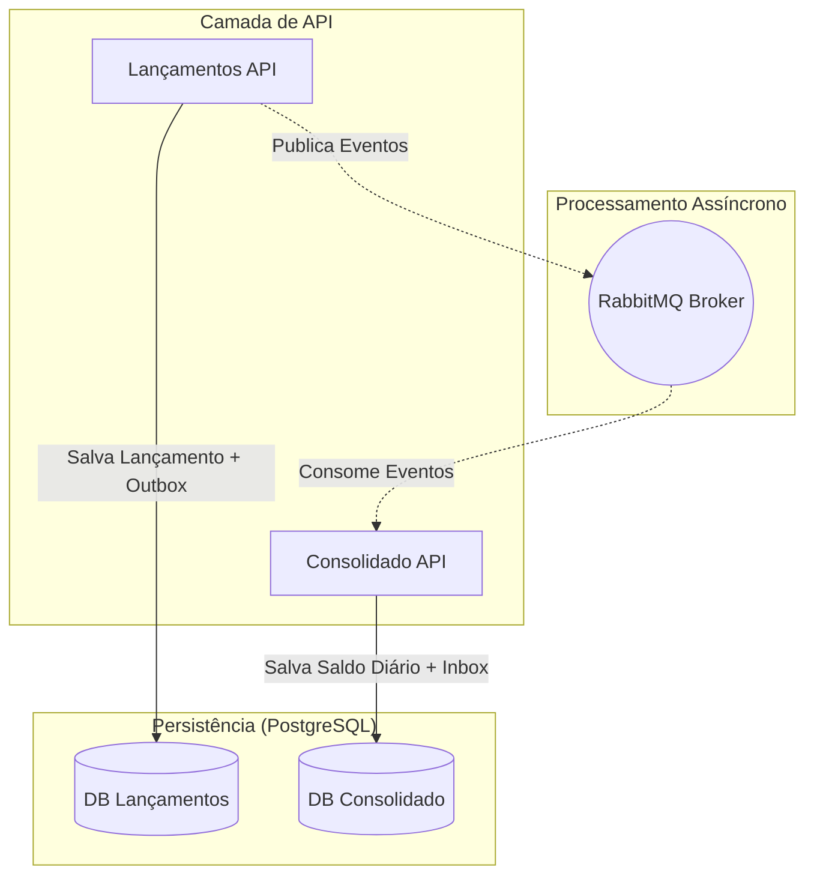
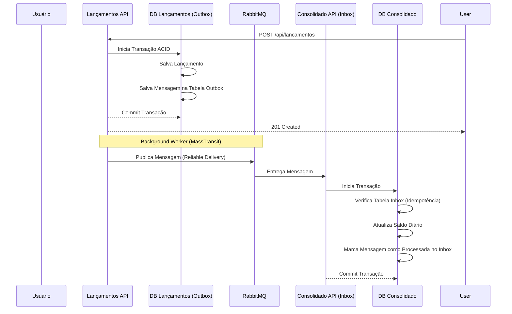
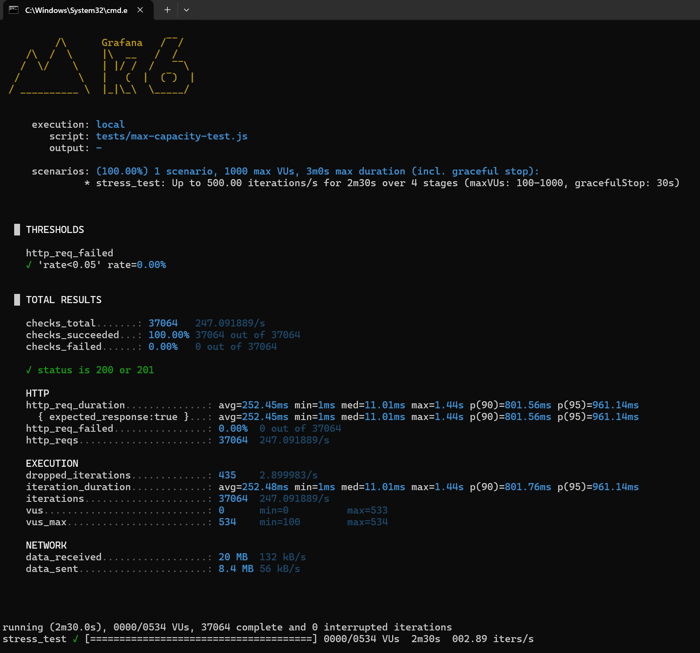

# CashFlow Solution - Teste Arquiteto de Software Sênior VERX

Este projeto é uma solução completa para o desafio de controle de fluxo de caixa, desenvolvida com foco em **escalabilidade**, **resiliência** e **observabilidade**. A arquitetura foi desenhada para suportar alta carga (50 req/s) mantendo a integridade dos dados através de padrões de mensageria e consistência eventual.

## Arquitetura do Sistema

A solução utiliza uma arquitetura de **microsserviços** baseada em **Domain-Driven Design (DDD)** e **CQRS (Command Query Responsibility Segregation)** básico via MediatR.

### Diagrama de Contexto (C4 Model - Level 2)



### Fluxo de Dados (Outbox & Inbox Pattern)

Este fluxo garante que **nenhuma mensagem seja perdida** e que o processamento seja **idempotente**.


## Padrões e Práticas Aplicadas

- **Outbox Pattern**: Garante a consistência atômica entre a persistência do banco de dados e a publicação de mensagens no RabbitMQ.
- **Inbox Pattern (Idempotência)**: O serviço consolidado utiliza o Inbox do MassTransit para garantir que cada lançamento seja processado exatamente uma vez, mesmo em caso de reenvio de mensagens.
- **Resiliência (Polly)**: Configurações de **Retry** e **Circuit Breaker** no pipeline do MassTransit para lidar com falhas transitórias.
- **Observabilidade (OpenTelemetry)**: Rastreamento distribuído e métricas integradas para monitoramento de performance e erros.
- **Value Objects**: Uso de tipos fortes para conceitos de negócio como `Money`, evitando "Primitive Obsession".

## Resultados do Teste de Stress (k6)
O teste de capacidade máxima foi executado com o script `tests/max-capacity-test.js`, que simula uma rampa de carga progressiva partindo de 50 req/s até 500 req/s, ou seja, a solução atendeu **5x o requisito do desafio** com **0% de perda** (com todas as limitações 



**Nota sobre o ambiente de execução:** O teste foi realizado em ambiente local com Docker Desktop (WSL), que por padrão limita os recursos disponíveis para os containers via WSL2 (CPU, memória e I/O). O resultado de ~247 req/s reflete esse teto de ambiente, não o teto da aplicação. Em um ambiente com recursos dedicados o throughput real seria significativamente maior.

## Como Executar

### Pré-requisitos
- Docker e Docker Compose instalados.

### Passo a Passo
1. Na raiz do projeto, execute:
   ```bash
   docker-compose up -d
   ```
2. Acesse o Swagger dos serviços:
   - **Lançamentos**: `http://localhost:5001/swagger`
   - **Consolidado**: `http://localhost:5002/swagger`

## Teste de Stress (Stress Test)

Para validar o requisito de **50 requisições por segundo com no máximo 5% de perda**, recomendo o uso da ferramenta **k6** (Gratuita).

### Como Rodar no Windows:
1. Instale o k6 via Chocolatey: `choco install k6` ou baixe o instalador em [k6.io](https://grafana.com/docs/k6/latest/set-up/install-k6/).
2. Na pasta do projeto, execute o script que fornecemos:
   ```bash
   k6 run tests/stress-test.js
   ```
O script simula 50 usuários simultâneos fazendo lançamentos constantes por 1 minuto e falhará automaticamente se a taxa de erro for superior a 5% ou a latência (p95) for superior a 500ms.
Também foi incluído um teste de carga para identificar a capacidade máxima do seu hardware:
   ```bash
   k6 run tests/max-capacity-test.js
   ```

## Decisões Arquiteturais (ADRs)

Para detalhes sobre as decisões técnicas tomadas, consulte a pasta [docs/adr](./docs/adr).

- [ADR 001: Outbox Pattern com MassTransit](./docs/adr/001-outbox-pattern-mass-transit.md)
- [ADR 002: PostgreSQL como Banco de Dados Principal](./docs/adr/002-postgresql-as-main-db.md)
- [ADR 003: Observabilidade com OpenTelemetry](./docs/adr/003-opentelemetry-for-observability.md)

## Disclaimer sobre dependências
Este projeto utiliza as bibliotecas MediatR e MassTransit (apenas v9+) em versões que possuem licenciamento comercial.
A escolha foi intencional, considerando produtividade, clareza arquitetural e adoção de boas práticas amplamente utilizadas no mercado (como CQRS, mensageria e desacoplamento de componentes).
Em um cenário real de produção, a adoção dessas bibliotecas seria avaliada considerando custo, contexto do projeto e alternativas, quando aplicável.

## Stack Tecnológica

### Plataforma e Linguagem

| Tecnologia | Versão | Uso |
|---|---|---|
| .NET | 10.0 | Plataforma de runtime para todos os serviços |
| C# | 13 (latest) | Linguagem principal |
| ASP.NET Core | 10.0 | Framework web para as APIs REST |

---

### Serviços de Infraestrutura

| Serviço | Versão (imagem) | Uso |
|---|---|---|
| PostgreSQL | 16-alpine | Banco de dados principal (instância separada por microsserviço) |
| RabbitMQ | 3-management-alpine | Message broker para comunicação assíncrona entre serviços |

---

### Bibliotecas

#### Mensageria e Resiliência

| Pacote | Versão | Uso |
|---|---|---|
| `MassTransit` | 8.5.8 | Abstração de mensageria sobre o RabbitMQ |
| `MassTransit.RabbitMQ` | 8.5.8 | Transport do MassTransit para o RabbitMQ |
| `MassTransit.EntityFrameworkCore` | 8.5.8 | Suporte ao Outbox/Inbox Pattern via EF Core (persistência transacional de mensagens) |

#### Persistência

| Pacote | Versão | Uso |
|---|---|---|
| `Microsoft.EntityFrameworkCore` | 10.0.5 | ORM principal |
| `Npgsql.EntityFrameworkCore.PostgreSQL` | 10.0.1 | Driver do PostgreSQL para o EF |

#### Aplicação

| Pacote | Versão | Uso |
|---|---|---|
| `MediatR` | 14.1.0 | Implementação do padrão CQRS via Mediator (Commands, Queries, Handlers) |
| `FluentValidation` | 12.1.1 | Validação de Commands e Queries |
| `FluentValidation.DependencyInjectionExtensions` | 12.1.1 | Registro automático de validadores do FluentValidation |

#### Observabilidade

| Pacote | Versão | Uso |
|---|---|---|
| `OpenTelemetry.Extensions.Hosting` | 1.15.0 | Integração do OpenTelemetry com o host do ASP.NET Core |
| `OpenTelemetry.Instrumentation.AspNetCore` | 1.15.1 | Rastreamento automático de requisições HTTP recebidas |
| `OpenTelemetry.Instrumentation.Http` | 1.15.0 | Rastreamento automático de chamadas HTTP de saída |
| `OpenTelemetry.Instrumentation.Runtime` | 1.15.0 | Métricas de runtime do .NET (GC, threads, memória e etc) |
| `OpenTelemetry.Exporter.Console` | 1.15.0 | Exportação de traces e métricas para o console |
| `Npgsql.OpenTelemetry` | 10.0.2 | Instrumentação de queries ao PostgreSQL via OpenTelemetry |
| `Serilog.AspNetCore` | 10.0.0 | Logging estruturado com integração nativa ao ASP.NET Core |

#### API

| Pacote | Versão | Uso |
|---|---|---|
| `Swashbuckle.AspNetCore` | 10.1.5 | Geração de documentação OpenAPI (Swagger UI) |
| `AspNetCore.HealthChecks.NpgSql` | 9.0.0 | Health check do PostgreSQL via endpoint `/health` |
| `AspNetCore.HealthChecks.Rabbitmq` | 9.0.0 | Health check do RabbitMQ via endpoint `/health` |

---

### Bibliotecas de Testes

| Pacote | Versão | Uso |
|---|---|---|
| `xunit.v3.mtp-v2` | 3.2.2 | Framework de testes unitários (xUnit v3) |
| `NSubstitute` | 5.3.0 | Framework de mocking para isolamento de dependências |
| `FluentAssertions` | 8.9.0 | Assertions legíveis e expressivas nos testes |
| `Microsoft.Testing.Extensions.CodeCoverage` | 18.5.2 | Coleta de cobertura de código |

---

### Ferramentas de Teste de Carga

| Ferramenta | Uso |
|---|---|
| `k6` | Teste de stress e capacidade máxima da API de Lançamentos |

Dois scripts disponíveis em `tests/`:
- **`stress-test.js`** - valida o requisito de 50 req/s com no máximo 5% de falha e p95 < 500ms
- **`max-capacity-test.js`** - sonda o limite máximo do sistema com rampa de carga progressiva (50 → 100 → 250 → 500 req/s)

---

### Infraestrutura

| Tecnologia | Uso |
|---|---|
| Docker | Containerização de todos os serviços |
| Docker Compose | Orquestração local completa (infra + aplicações) |
